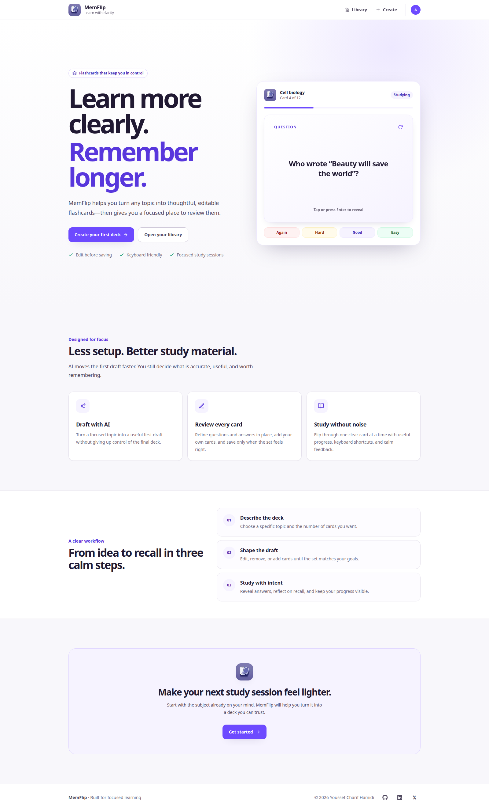
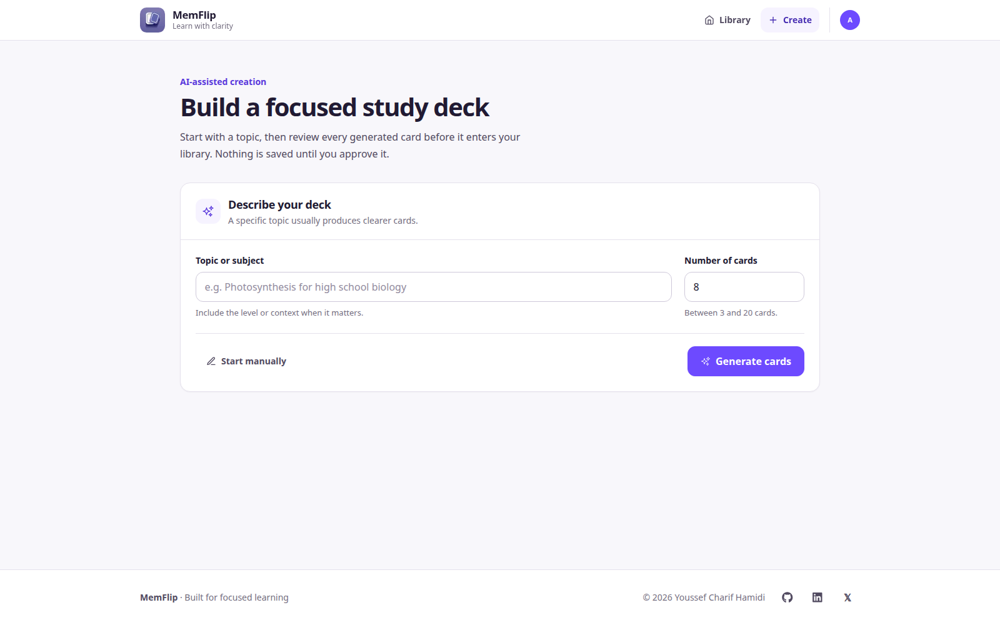
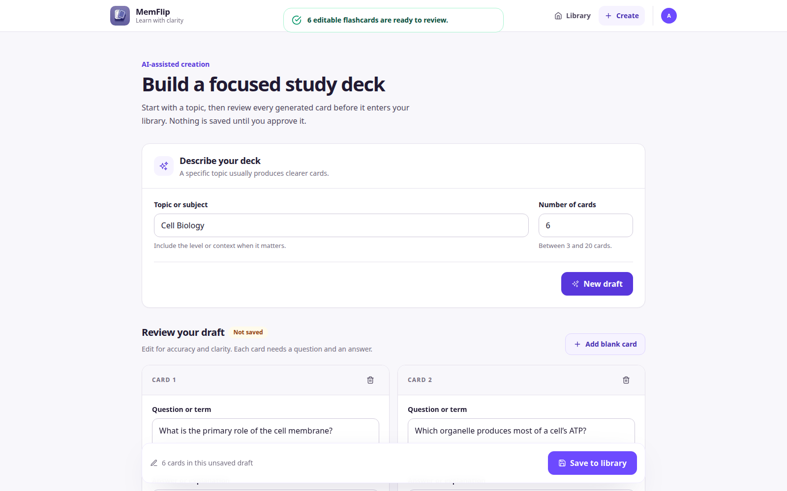
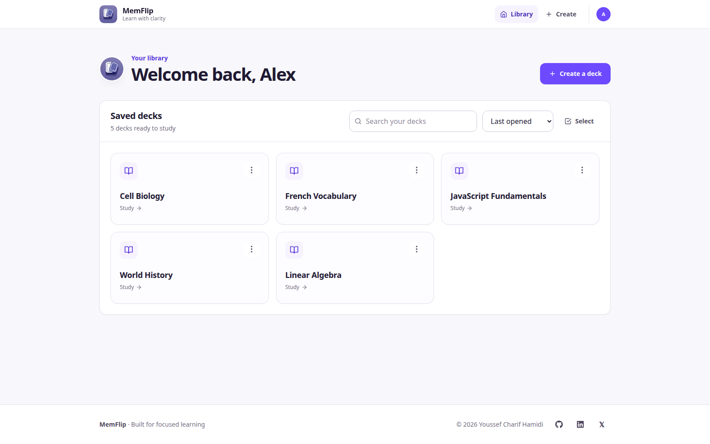
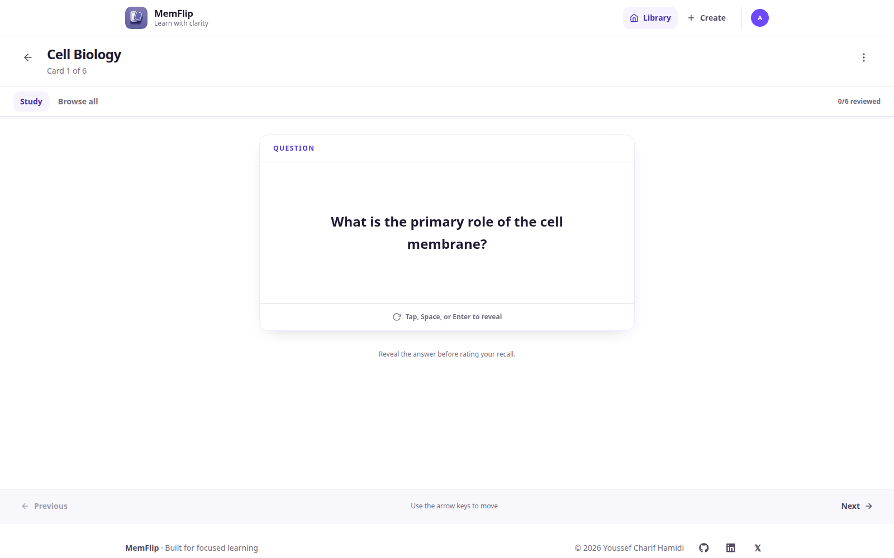

# MemFlip

MemFlip is an AI-assisted flashcard application for drafting, refining,
organising, and studying focused learning material.

It combines fast AI generation with deliberate human review. Every generated
card remains editable, nothing enters the learner's library without approval,
and completed study feedback becomes a compact history for each deck.

[Open MemFlip](https://mem-flip.live)



## Highlights

- Generate an initial 3–20 card draft from a focused topic.
- Extend a draft with additional AI-generated cards without repeating existing
  questions, up to a 20-card limit.
- Start manually and build a deck without AI.
- Edit every question and answer, add blank cards, and undo removals before
  saving.
- Search saved decks and sort by last opened, creation date, or title.
- Rename, edit, delete, or bulk-delete saved decks.
- Browse a complete deck or study one card at a time.
- Flip cards with mouse, touch, Enter, or Space.
- Navigate study sessions with buttons or arrow keys.
- Reflect on recall with Forgot, Hard, Good, and Easy responses.
- Turn ratings into a weighted 0–100% recall score: Forgot = 0, Hard = 1,
  Good = 2, and Easy = 3 points.
- Follow every completed revision on an interactive line chart with 1-day,
  1-week, 1-month, and 3-month views.
- Inspect the date, time, and score of any trend point by hovering, focusing, or
  selecting it.
- Use the application comfortably across mobile, tablet, and desktop layouts.

## Product experience

### Create

Enter a focused subject and choose between 3 and 20 cards for the initial
draft. MemFlip shows a layout-matched loading state while Groq returns
structured flashcard data, and it preserves the topic if generation fails.



Generated cards are clearly marked as unsaved. Questions and answers use
auto-resizing fields and inline validation, while blank cards can be added
manually and removed cards can be restored with Undo.

An existing draft can be extended in place by requesting between 1 card and the
number of slots remaining in the 20-card limit. Existing questions are sent as
exclusions, duplicate results are filtered, and the current draft remains
unchanged if enough unique cards cannot be produced. Replacing the entire draft
still requires confirmation.

A deck can only be saved after every question and answer is complete. The
explicit save state distinguishes an editable draft from content already stored
in the library.



### Organise

Saved decks live in a searchable library scoped to the signed-in Clerk user.
Decks can be sorted by last opened, creation date, or title A–Z/Z–A. Each deck
includes actions to study, edit, rename, or delete it, and selection mode
supports deleting multiple decks together.

Loading, empty, no-result, and network-error states are distinct, so the
interface always communicates what is happening and what to do next.



### Study

Each saved deck supports three views:

- **Study:** A focused, one-card experience with progress and directional
  navigation. Reveal the answer, rate recall as Forgot, Hard, Good, or Easy,
  then review the rating totals, open recent deck stats, or study again.
- **Browse all:** A responsive grid for scanning and flipping every card in the
  deck.
- **Stats:** Latest and recent-average recall scores, an adjustable trend line,
  and a compact history with the Forgot, Hard, Good, and Easy distribution for
  every recent revision. Each completed session remains its own trend point,
  including sessions completed on the same day.

Flashcards use a stable 3D scene to avoid layout shifts or face bleed during
flips. Long content scrolls within the card without changing its dimensions.
The deck menu also provides direct edit and delete actions.



## Accessibility

MemFlip includes:

- Full keyboard navigation and visible focus states.
- A skip link and semantic page structure.
- Accessible dialogs with focus trapping, Escape handling, focus restoration,
  and scroll locking.
- Screen-reader announcements for card side, progress, loading, errors, and
  completion.
- Keyboard-focusable recall trend points with date, time, and score details.
- Comfortable touch targets and sufficient colour contrast.
- A complete `prefers-reduced-motion` fallback, including non-animated card
  flipping.

## Technology

- [Next.js](https://nextjs.org/) App Router and TypeScript
- [React](https://react.dev/)
- [Tailwind CSS](https://tailwindcss.com/) with shared design tokens
- [Clerk](https://clerk.com/) for authentication
- [Cloud Firestore](https://firebase.google.com/docs/firestore) for saved decks
- [Groq](https://groq.com/) for structured JSON AI generation
- [Vercel Analytics](https://vercel.com/analytics)

No separate animation library is required. Motion is implemented with
lightweight CSS transforms and opacity transitions.

## Getting started

### Prerequisites

- Node.js 20 or newer
- npm
- Clerk, Firebase, and Groq projects

### Install

```bash
git clone git@github.com:Chareeef/MemFlip.git
cd MemFlip
npm install
```

### Environment variables

Create `.env.local` and provide:

```dotenv
NEXT_PUBLIC_CLERK_PUBLISHABLE_KEY=
CLERK_SECRET_KEY=

GROQ_API_KEY=

FIREBASE_API_KEY=
FIREBASE_AUTH_DOMAIN=
FIREBASE_PROJECT_ID=
FIREBASE_STORAGE_BUCKET=
FIREBASE_MESSAGING_SENDER_ID=
FIREBASE_APP_ID=
FIREBASE_MEASUREMENT_ID=
```

For a project already connected to Vercel, the variables can be pulled with:

```bash
npx vercel link
npx vercel env pull .env.local
```

Use `--environment=production` or `--environment=preview` when you need a
different Vercel environment.

Never commit `.env.local` or expose its values in client-side code.

### Run locally

```bash
npm run dev
```

Open [http://localhost:3000](http://localhost:3000).

## Available commands

```bash
npm run dev
npm run lint
npm exec tsc -- --noEmit
npm run build
npm start
```

## Project structure

```text
app/
├── api/
│   ├── generate_flashcards/ # Groq generation and uniqueness handling
│   └── firestore/           # Authenticated deck persistence routes
├── components/
│   ├── ui/                 # Shared button, modal, and empty-state primitives
│   ├── Flashcards.tsx      # Responsive browseable card grid
│   └── StudySession.tsx    # Focused study and completion flow
├── decks/[subject]/        # Study view and saved-deck editor
├── generate_flashcards/    # AI/manual creation and draft extension
├── home/                   # Authenticated deck library
├── sign-in/                # Clerk sign-in flow
├── sign-up/                # Clerk registration flow
├── globals.css             # Design tokens, shared styles, and motion
└── page.tsx                # Public landing page
```

## Data model

A flashcard contains two string fields:

```ts
interface Flashcard {
  front: string;
  back: string;
}

interface DeckSummary {
  id: string;
  subject: string;
  createdAt: number | null;
  lastOpenedAt: number | null;
}

type RecallRating = 1 | 2 | 3 | 4;

// 1 = Forgot, 2 = Hard, 3 = Good, 4 = Easy

interface ReviewSession {
  id: string;
  completedAt: number;
  cardCount: number;
  ratingCounts: Record<RecallRating, number>;
}
```

Decks are stored in Firestore at `users/{userId}/flashcards/{deckId}`. The deck
title is its document ID; renaming a deck atomically moves its cards and
metadata to the new ID. Creation and last-opened timestamps support library
sorting.

Completed revisions are stored with each deck as a bounded history of 50
sessions. Recall is calculated as a normalized weighted score:

```text
(Hard + 2 × Good + 3 × Easy) ÷ (3 × card count) × 100
```

Forgot contributes zero points. The result is rounded to the nearest whole
percentage. The Stats tab shows the latest 10 sessions and their rating
distributions. Its line chart defaults to the latest week and can display the
last day, 30 days, or 90 days instead. Every session is retained as a separate
point, ordered by its completion time; nearby points are spaced visually to
remain usable. Hovering, focusing, or selecting a point reveals its exact date,
time, and score. These scores track performance but do not yet schedule future
review dates.

## Validation

Before publishing changes, run:

```bash
npm run lint
npm exec tsc -- --noEmit
npm run build
git diff --check
```

## License

No license has been specified for this repository.
